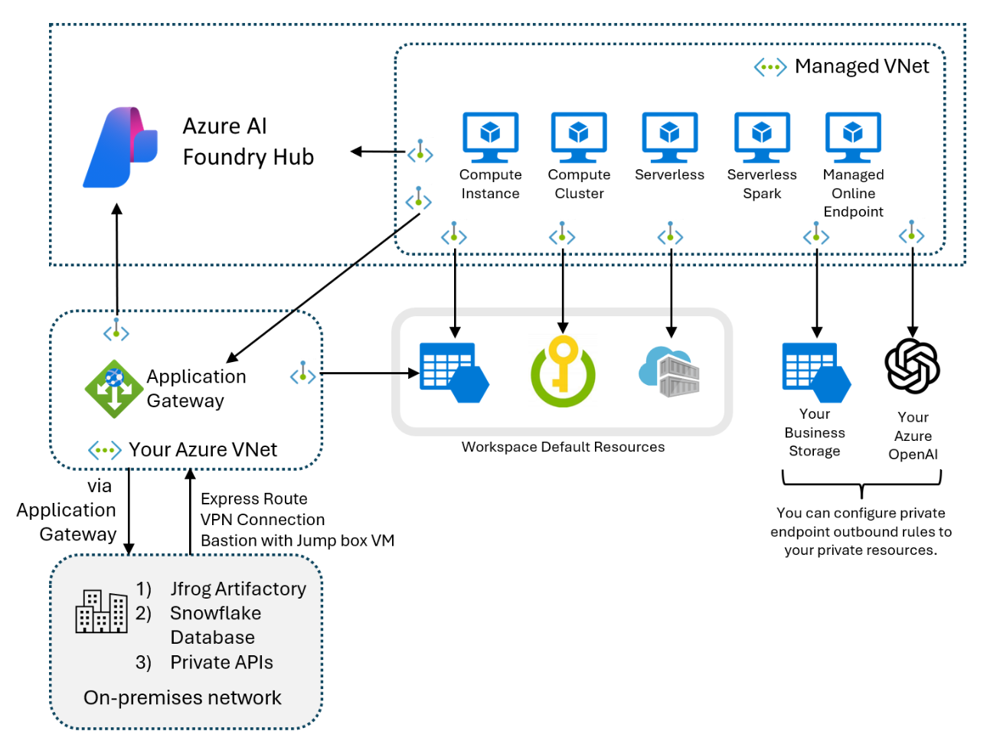

## [Introduction to AI Agent Service Security Controls](https://learn.microsoft.com/en-us/training/modules/intro-ai-agent-service-security-controls/)

#### Agent Security Principals
- Restrict access to the service using role based access control.
    - Ensure that only appropriate security principals can interact with the AI agent service and institute the principle of least privilege.
- Restrict the access of the AI Agent service.
    - The AI Agent service is interacting with sensitive resources, such as organizational data.
    - Ensure that the scope of this access is limited and that the AI Agent service and its tools only have necessary visibility of resources such as data stores.
- Restrict network access to the AI Agent service and the network access of the AI agent service.
    - Limit which network hosts can interact with the AI Agent service and control which network hosts the AI Agent service and it's associated tools are able to reach.

#### Securing the Azure AI Agent Service
- AI Foundry Projects function as isolated development spaces, allowing developers and data scientists to build, test, and deploy AI systems.
- Each time a new project gets created within a hub, it automatically inherits that hub's security settings.
- Agents, being part of projects, can leverage the resources and configurations set at both the hub and project levels.
- You can apply security controls through the Azure AI Foundry interface or by applying security controls through the Azure portal.
- When you deploy a hub and project, these resources are stored within a resource group in your Azure subscription.
- The Azure AI Foundry provides an abstracted way of interacting with these security controls without requiring an understanding of Azure administration principles.
- Azure AI Foundry allows you to configure role based access control roles.
Within the Azure portal, you can configure the following security settings at the Azure AI Hub level:
    - Role based access control
    - Network access
    - Monitoring alerts, metrics and logs
- You can't configure network access within AI Foundry.

#### Agent Service and Network Access
- You have the following options when configuring network access:
    - **Public access**
        - Either allow public access from all networks including the internet or disable public access.
        - If you disable public access, you need to access the hub, project, and AI Agent service through a private endpoint.
    - **Private endpoint connections**
        - Allows you to add private endpoints to access the hub, projects, and Azure AI Agents.
        - When configuring private endpoint access, you can allow access from specific virtual networks and subnets.
        - Private endpoints require a DNS address that can be hosted in a private DNS zone.
    - **Workspace managed outbound access**
        - When configuring outbound access for the Azure AI hub associated with the project that hosts the Azure AI Agent, you can choose...
            - `Disabled`: Compute can access public resources and outbound data movement is unrestricted.
            - `Allow Internet Outbound`: Compute can access private resources and outbound data movement is unrestricted.
            - `Allow Only Approved Outbound`: Compute can access resources that specifically allow listed and outbound data movement is restricted to approved addresses.
- To access your non-Azure resources located in a different virtual network or located entirely on-premises from your Azure AI Foundry's managed virtual network, you need to configure and deploy an Application Gateway.
- Through this Application Gateway, you can configure full end to end access to your resources.
- Once you configure the Application Gateway, you can create a private endpoint from the Azure AI Foundry hub's managed virtual network to the Application Gateway.
- An Azure Private Endpoint enables private access to specific resources, such as Azure Foundry Hubs and their projects, without exposing them to the public internet, ensuring data remains isolated and secure.

##### See also...
- [Role-based access control in Azure AI Foundry portal](https://learn.microsoft.com/en-us/azure/ai-foundry/concepts/rbac-azure-ai-foundry)
- [Create a new network-secured agent with user-managed identity](https://learn.microsoft.com/en-us/azure/ai-services/agents/how-to/virtual-networks)
- [How to create a secure Azure AI Foundry hub and project with a managed virtual network](https://learn.microsoft.com/en-us/azure/ai-foundry/how-to/create-secure-ai-hub)
- [Access on-premises resources from your Azure AI Foundry's managed network](https://learn.microsoft.com/en-us/azure/ai-foundry/how-to/access-on-premises-resources)

#### Azure AI Agent Service RBAC
- AI Foundry hub built-in roles...
    - Owner
    - Contributor
    - Azure AI Administrator
    - Azure AI Developer
    - Azure AI Inference Deployment Operator
    - Reader

