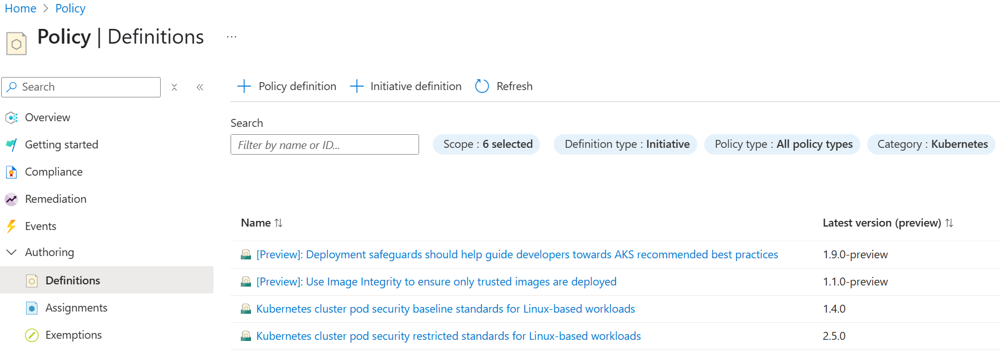

## [Deploy applications to Azure Kubernetes Service](https://learn.microsoft.com/en-us/training/modules/deploy-applications-azure-kubernetes-service/)
- See also: [Deploy containers by using Azure Kubernetes Service (AKS)](https://learn.microsoft.com/en-us/training/paths/deploy-manage-containers-azure-kubernetes-service/)


### [Configure Azure Kubernetes pods using Azure Policy](https://learn.microsoft.com/en-us/training/modules/deploy-applications-azure-kubernetes-service/2-azure-kubernetes-pod-configuration)
- You can apply and enforce security settings on Azure Kubernetes Service cluster-hosted pods by using Azure Policy.
- Azure Policy helps enforce organizational standards and assess compliance at-scale.
- After you install the Azure Policy add-on for AKS, you can assign built-in and custom policy definitions either individually or in groups referred to as policy initiatives.

### [Exercise: Apply Azure Kubernetes Service pod settings using Azure Policy](https://learn.microsoft.com/en-us/training/modules/deploy-applications-azure-kubernetes-service/3-apply-pod-settings)
- Install the Azure Policy add-on for AKS
    ```bash
    az provider register --namespace Microsoft.PolicyInsights
    az provider show --namespace Microsoft.PolicyInsights --output table

    AKSRG='syd-npd-aks2-rg'
    AKSNAME='syd-npd-aks2'

    az aks addon list-available
    az aks addon list --name $AKSNAME --resource-group $AKSRG

    az aks enable-addons --addons azure-policy --name $AKSNAME --resource-group $AKSRG

    kubectl get pods --namespace kube-system
    kubectl get pods --namespace gatekeeper-system
    kubectl get constrainttemplates
    ```
- Assign an Azure Policy initiative to an AKS cluster

- Validate the effect of Azure Policy
    - Try to deploy a pod with `securityContext: priviledged: true` will be denied

### [Configure storage for applications running on Azure Kubernetes Service](https://learn.microsoft.com/en-us/training/modules/deploy-applications-azure-kubernetes-service/4-configure-application-azure-kubernetes-cluster)

#### Storage Services
- **Application-level access to structured or semi-structured data**. For structured or semi-structured data, use a platform managed database, such as Azure `SQL`, Azure Database by MySQL, Azure Database for PostgreSQL, and `Cosmos DB`.
- **File-level access to data**. For shared application data that requires high performance, use either `Azure NetApp Files` or the premium tier of `Azure Files`. For shared data that requires moderate performance, use the standard tier of Azure Files.
- **Block-level access to data (self managed)**. For applications requiring consistently low latency, high IOPS, and high throughput, use `Azure Premium SSD`, Azure Premium SSD v2, or `Azure Ultra Disk Storage` for optimal performance. Alternatively, you can use `Azure Blob storage with BlobFuse`, a `virtual file system`, or interact with `Blob storage directly`. These storage options are self-managed using open-source `CSI drivers orchestrated by Microsoft`, providing flexibility to manually manage your infrastructure.
- **Block-level access to data (fully managed)**. For a fully managed, cloud-based volume management and orchestration solution, consider `Azure Container Storage`. It integrates with Kubernetes, allowing dynamic and automatic provisioning of persistent volumes. Azure Container Storage supports both Azure Disks and Ephemeral Disks as backing storage, offering flexibility and scalability for stateful applications running on Kubernetes clusters.

#### Pod Volume Types
- **emptyDir** is used as temporary space for pods. All containers within a pod can access the data on the volume. Data written to this volume type persists only for the lifespan of the pod. Once you delete the pod, the volume is deleted. This volume typically uses the underlying local node disk storage, though it's possible to host it in the node's memory.
- **secret** is used to inject into pods sensitive data, such as passwords.
- **configMap** is used to inject into pods key-value pair properties, frequently referencing application configuration settings.
- **PersistentVolume (PV)** is a block or file storage resource created and managed by the Kubernetes API that has the ability to persist beyond the lifetime of a pod.

### [Exercise: Configure storage for applications that run on Azure Kubernetes Service](https://learn.microsoft.com/en-us/training/modules/deploy-applications-azure-kubernetes-service/6-configure-storage-applications-run-azure-kubernetes)
- Create a custom storage class in an AKS cluster
    ```yaml
    apiVersion: storage.k8s.io/v1
    kind: StorageClass
    metadata:
    name: managed-premium-retain
    provisioner: disk.csi.azure.com
    parameters:
    skuName: Premium_LRS
    reclaimPolicy: Retain
    volumeBindingMode: WaitForFirstConsumer
    allowVolumeExpansion:
    ```
- Create a persistent volume claim in an AKS cluster
    ```yaml
    apiVersion: v1
    kind: PersistentVolumeClaim
    metadata:
    name: azure-managed-disk
    spec:
    accessModes:
    - ReadWriteOnce
    storageClassName: managed-premium-retain
    resources:
        requests:
        storage: 5Gi
    ```
- Deploy a pod with a persistent volume mount in an AKS cluster
    ```yaml
    kind: Pod
    apiVersion: v1
    metadata:
    name: nginx
    spec:
    containers:
        - name: myfrontend
        image: mcr.microsoft.com/oss/nginx/nginx:1.15.5-alpine
        volumeMounts:
        - mountPath: "/mnt/azure"
            name: volume
    volumes:
        - name: volume
        persistentVolumeClaim:
            claimName: azure-managed-disk
    ```
