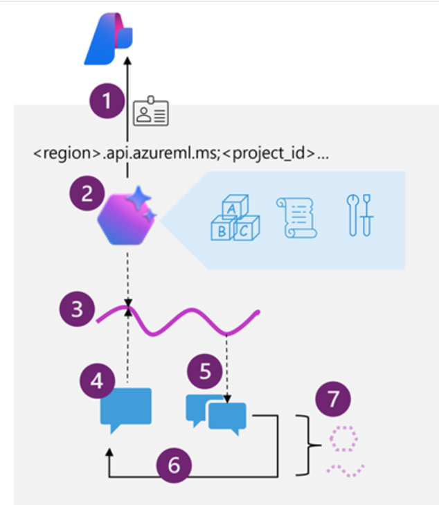

## [Develop an AI agent with Azure AI Agent Service](https://learn.microsoft.com/en-us/training/modules/develop-ai-agent-azure/)

#### Key features of Azure AI Agent Service
- **Automatic tool calling**: The service handles the entire tool-calling lifecycle, including running the model, invoking tools, and returning results.
- **Securely managed data**: Conversation states are securely managed using threads, eliminating the need for developers to handle this manually.
- **Out-of-the-box tools**: The service includes tools for file retrieval, code interpretation, and interaction with data sources like Bing, Azure AI Search, and Azure Functions.
- **Flexible model selection**: Developers can choose from various models, including Azure OpenAI models and others like Llama 3, Mistral, and Cohere.
- **Enterprise-grade security**: The service ensures data privacy and compliance with secure data handling and keyless authentication.
- **Customizable storage solutions**: Developers can use either platform-managed storage or bring their own Azure Blob storage for full visibility and control.

#### Azure AI Agent Service resources
- Basic agent setup: A minimal configuration that includes Azure AI hub, Azure AI project, and Azure AI Services resources.
- Standard agent setup: A more comprehensive configuration that includes the basic agent setup plus Azure Key Vault, Azure AI Search, and Azure Storage.
- [Bicep template](https://github.com/Azure/azure-quickstart-templates/tree/master/quickstarts/microsoft.azure-ai-agent-service)

#### Developing apps that use agents

1. Connect to the AI Foundry project for your agent, using the project connection string and Entra ID authentication.
1. Get a reference to an existing agent that you created in the Azure AI Foundry portal, or create a new one specifying:
    - The `model deployment` in the project that the agent should use to interpret and respond to prompts.
    - `Instructions` that determine the functionality and behavior of the agent.
    - `Tools and resources` that the agent can use to perform tasks.
1. Create a `thread` for a chat session with the agent. All conversations with an agent are conducted on a stateful thread that retains message history and data artifacts generated during the chat.
1. Add `messages` to the thread and invoke it with the agent.
1. Check the `thread status`, and when ready, retrieve the messages and data artifacts.
1. Repeat the previous two steps as a `chat loop` until the conversation can be concluded.
1. When finished, delete the agent and the thread to clean up the resources and delete data that is no longer required.

##### Tools available to your agent
- Knowledge tools
    - **Bing Search**: Uses Bing search results to ground prompts with real-time live data from the web.
    - **File search**: Grounds prompts with data from files in a vector store.
    - **Azure AI Search**: Grounds prompts with data from Azure AI Search query results.
    - **Microsoft Fabric**: Uses the Fabric Data Agent to ground prompts with data from your Fabric data stores.
- Action tools
    - **Code Interpreter**: A sandbox for model-generated Python code that can access and process uploaded files.
    - **Function**: Call your custom function code – you must provide function definitions and implementations.
    - **Azure Function**: Call code in serverless Azure Functions.
    - **OpenAPI Spec**: Call external APIs based on the OpenAPI 3.0 spec.

#### [Exercise - Build an AI agent](https://learn.microsoft.com/en-us/training/modules/develop-ai-agent-azure/5-exercise)
- [agent source code](./src/simple-agent/agent.py)
- Steps in the code...
    1. Connects to the AI Foundry project.
    1. Uploads the data file and creates a code interpreter tool that can access it.
    1. Creates a new agent that uses the code interpreter tool and has explicit instructions to analyze the data and create charts as .png files.
    1. Runs a thread with a prompt message from the user along with the data to be analyzed.
    1. Checks the status of the run in case there’s a failure
    1. Retrieves the messages from the completed thread and displays the last one sent by the agent.
    1. Displays the conversation history
    1. Saves each file that was generated.
    1. Deletes the agent and thread when they’re no longer required.
